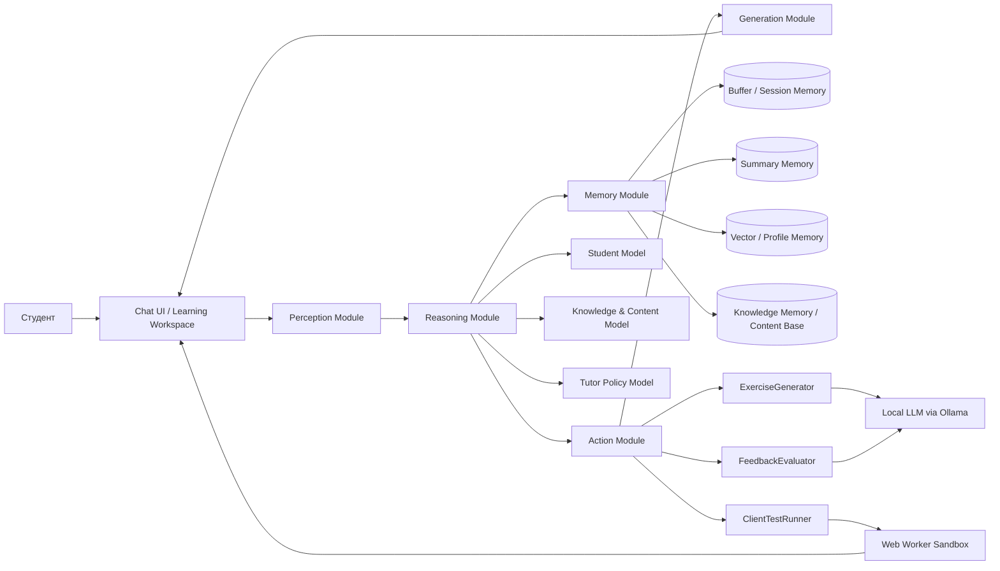
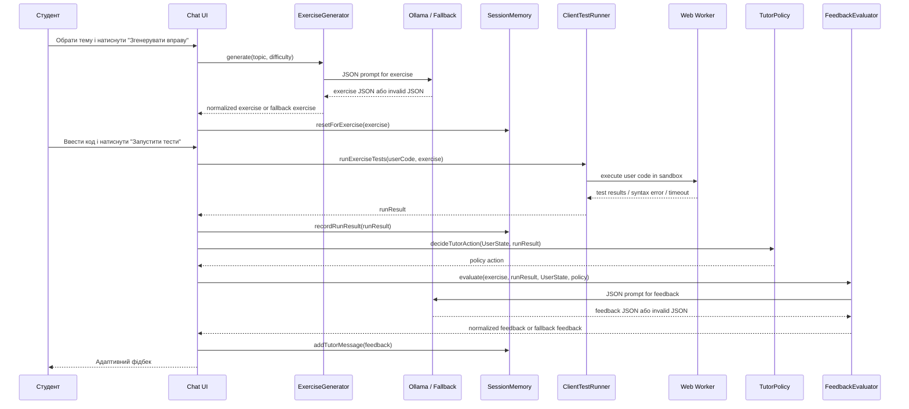
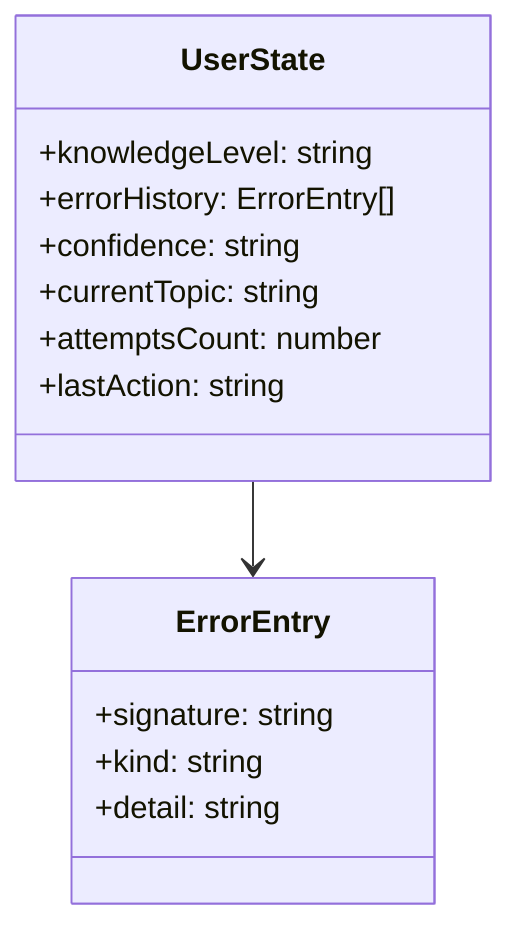
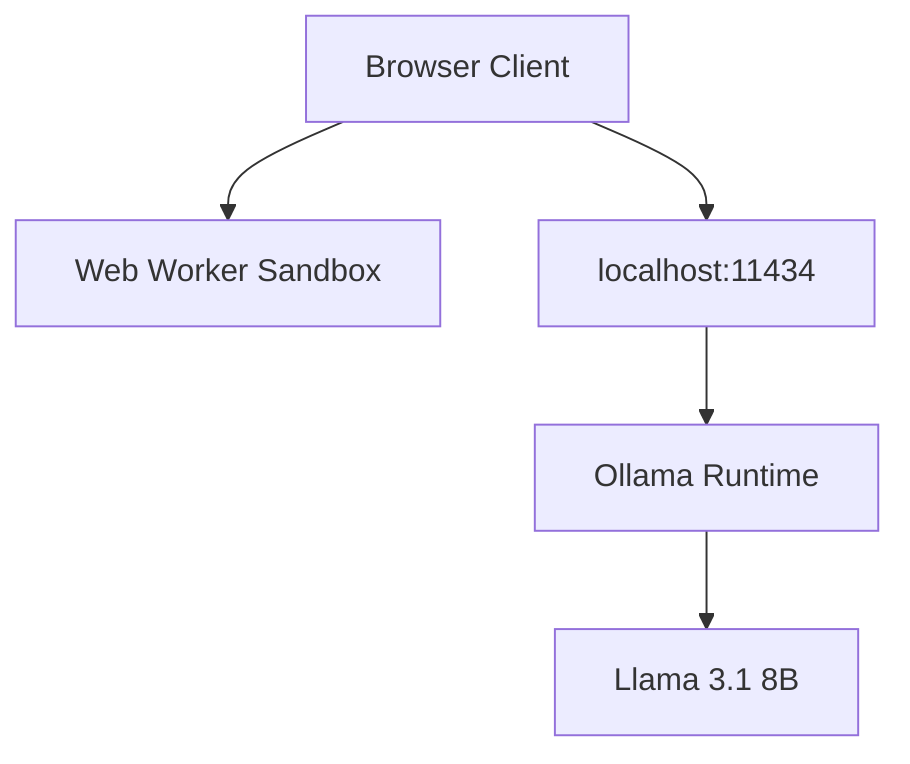

# Джерела для діаграм

Нижче наведено текстові першоджерела для діаграм, які можна:

- або відрендерити окремо в Mermaid/PlantUML;
- або використати як основу для ручного вставлення рисунків у Word;
- або залишити як figure placeholders у поточній автоматично згенерованій чернетці.

## 1. Діаграма компонентів АІНС

### Примітка

- У прототипі реально реалізовано: `Chat UI`, `ExerciseGenerator`, `FeedbackEvaluator`, `ClientTestRunner`, `SessionMemory`, `TutorPolicy`, `OllamaClient`.
- Концептуально описано, але не реалізовано: `Summary Memory`, `Vector/Profile Memory`, `Knowledge Memory`, окремий `Perception Module`.

## 2. Sequence diagram для сценарію "згенерувати вправу -> пройти тести -> дати фідбек"

## 3. Схема UserState

### Примітка

- У прототипі `UserState` зберігається в `SessionMemory`.
- Архітектурно в розділі 3 можна додати ще поля:
  - mastery per concept;
  - preferred explanation style;
  - session summary id;
  - long-term profile embedding id.

## 4. Спрощена deployment/runtime diagram

### Примітка

- У поточному середовищі `ollama` не встановлено, тому в прототипі потрібно показати також fallback-режим.

## 5. Figure placeholders для Word

- Рисунок 3.1 - Загальна компонентна архітектура АІНС для JavaScript tutor.
- Рисунок 3.2 - Цикл роботи агента за патерном Reason -> Act -> Observe.
- Рисунок 3.3 - Структура `UserState` та зв'язок із `SessionMemory`.
- Рисунок 4.1 - Runtime-схема прототипу з локальним Ollama та `Web Worker`.

## 6. Підстава для ручного доопрацювання

- [ПОТРІБНО РУЧНЕ ВТРУЧАННЯ: за потреби відрендерити Mermaid-схеми у PNG/SVG і замінити figure placeholders у Word-файлі].
